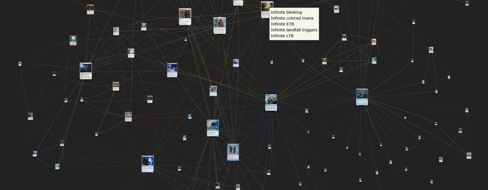

This is a visualizer for finding combos with https://commanderspellbook.com.  
Every coloured connection between multiple cards is a infinite combo. The bigger the card, the more combos it's a part of. 

## Setup
### Install Python
https://www.python.org/downloads/

### Setup Python
```bash
# go to the folder you cloned this repo to, set up a python virtual environment
python -m venv venv
# activate the venv
# windows
.\venv\Scripts\activate
# linux
source venv/bin/activate
```


### Setup & Run Jupyter Notebook

https://jupyter.org/install

```bash
pip install notebook
jupyter notebook
```
## Getting started
# How to start crawling

- The CLI will display the port your jupyter notebook is running on
- the code is in http://localhost:8888/notebooks/main.ipynb
- edit he color identiy & your starting point, for example for a blue, white flicker deck:
```py
color_name = "Azorius"
card_names = [
    "Wormfang Drake",
    "Teleportation Circle"
            ]
```
- you can remove cards via the `removelist` from your graph. Especially if you dig deeper, cards like [Ashnod's Altar](https://scryfall.com/card/ema/218/ashnods-altar) tend to create massive clumps.